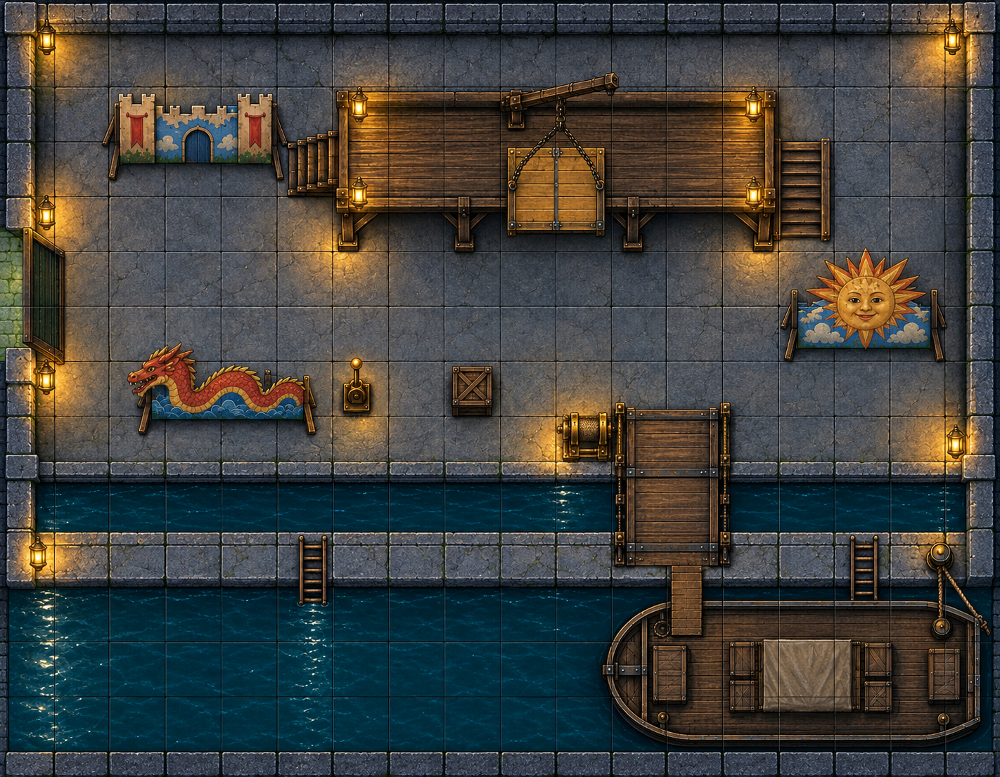

# Act 2, Session 3 — “The Last Receipt”

> **Prepared, not played.** A 150-minute Capital session beginning immediately after Demona catches Commissioner Ottaviano Bellafonte. The heroes break his nerve, retain their limited deputy work, use his emergency code to lure Rudiger Fenwick, and fight a paid cleanup crew at the Third Ledger Lift Yard. Player-facing dialogue and read-aloud appear in italicized blockquotes. Other text is for the Director.
>
> **Standalone Markdown only.** Do not run the Draw Steel synchronization script, import character data, or update app-managed state while preparing or using this document. Record actual outcomes after play.

## At a glance

- **Four heroes:** M.A.C., Keth, Demona and Dorian. Use their actual level and resources at the table.
- **Runtime:** 135 planned minutes plus a protected 15-minute buffer.
- **One combat:** Standard difficulty, three hostile profiles, no reinforcements, four-round cap.
- **Zero montage tests.** The interrogation gives required information directly; the sting permits at most two consequential tests.
- **Respite before the fight:** Fenwick schedules the exchange for the following night, allowing the heroes to complete the required 24-hour respite. They regain all Stamina and Recoveries; their Victories convert to XP and reset normally. Players handle any sheet changes themselves.
- **Prepared rewards:** Up to 2 Victories after the respite—1 for overcoming the cleanup crew without losing Bellafonte's ledger, and 1 for securing Fenwick or his corroborating satchel.
- **Knowledge boundary:** Bellafonte and Fenwick can expose Civic Loomworks and Festooning. Neither can name Baldo Merovanni, Corvane Dury, the Author's location, or the source of the erasures.

### Run order — 150 minutes

| Table time | Scene | Allocation |
| --- | --- | --- |
| **0:00–0:25** | 1. Bellafonte breaks | Three disclosures, immediate pressure, ledger and code |
| **0:25–0:35** | 2. Handoff and a new partnership | Hanae takes custody; Melvin returns after his off-screen dismissal |
| **0:35–1:00** | 3. Build the sting | Melvin's reconnaissance, respite and two preparations |
| **1:00–1:15** | 4. The exchange | Draw Fenwick into a self-incriminating meeting |
| **1:15–1:55** | 5. The Blue-Wax Retrieval | Standard four-round objective combat |
| **1:55–2:15** | 6. Independent proof | Evidence, Melvin's next investigation and water restored at Cistern Steps |
| **2:15–2:30** | Buffer | Absorb play; if unused, let the heroes speak with the Cistern Steps residents |

**Protect the buffer.** At minute 20, Bellafonte gives the remaining disclosures after the next decisive escalation. Once the heroes establish two preparations, cut to the exchange. Start initiative by 1:15. End the paid crew's participation at the end of round 4; do not play a fifth cleanup round.

## What is really happening — Director only

Bellafonte knowingly certified repairs that never happened. Fenwick delivered gifts, collected signatures and carried invoices for **Civic Loomworks and Festooning**. Bellafonte kept a private ledger as insurance against Fenwick. Its entries prove their relationship but stop at the contractor.

Fenwick escaped the basement gallery without knowing whether Bellafonte was captured. The phrase **“The collection is closed. I kept the last receipt”** means Bellafonte has retained evidence and needs an emergency meeting. Fenwick handles such messages personally because he cannot let ordinary Loomworks employees read the ledger. He nevertheless brings a paid retrieval crew with orders to recover the book, extract him if necessary and silence Bellafonte if the meeting is compromised.

The blue-wax satchel contains Loomworks dispatches marked **L.R.A.** and a schedule for moving one Bureau of Accounts file. It does not explain the initials. This is a later route toward the Lantern Relief Account and Oria Palomar, not a shortcut to Merovanni or Dury.

Veros dismisses Melvin during the 24-hour interval before the sting. That conversation occurs off-screen. Losing the badge makes Melvin more independent, not passive: he returns with his own notebook, performs the sting reconnaissance and proposes an ongoing investigative partnership.

### Continuity locks

- Vesk Aldermere was publicly erased into ash. Her case is not solved here.
- Vharos Kell is dead. His cell's defeat did not create a citywide power vacuum.
- The heroes remain citizen deputies for the Bellafonte–Fenwick repair-fraud claim. Their work letters are limited assistance papers, not universal warrants or immunity.
- Demona caught Bellafonte after the gallery fight. Fenwick escaped.
- The basement constructs were ordinary magical security, not evidence about M.A.C.'s personhood or the Author's mechanism.
- Melvin's firing is learned from Melvin afterward. Do not stage a Veros scene the heroes could not witness.
- Preserve the actual Session 2 evidence, rewards, Stamina, Recoveries and Victories until the respite occurs.

## Dramatis personae

### Commissioner Ottaviano Bellafonte — captured and frightened

- **Who:** Fulcrum-appointed repairs commissioner for the Dog-leg; wealthy collector; signer of false completion reports.
- **What he wants now:** Immediate safety from pain, followed by protection from Fenwick's employers.
- **What he knows:** Fenwick's name and habits, Civic Loomworks, warm-blue wax, his own bribes, the insurance ledger and the emergency phrase.
- **What he does not know:** Who funds Loomworks above the contractor level, what L.R.A. means, who killed Vesk, or anything reliable about the Author.
- **Running him:** He begins with status and denials, loses both quickly, and tries to make Fenwick sound like the sole architect. Concrete pressure works. He does not withstand physical harm out of ideological loyalty.
- **Pitfall:** Do not make his confession the whole conspiracy. He is a corrupt coward with one useful rung of knowledge.

### Rudiger Fenwick — escaped broker

- **Who:** A well-dressed intermediary paid by Civic Loomworks to deliver gifts, collect signatures and keep officials away from company officers.
- **What he wants:** Bellafonte's ledger destroyed, his satchel retained and a clean escape.
- **What he knows:** Loomworks offices, ordinary officers, dispatch procedures and account codes—including L.R.A. only as a billing code.
- **What he does not know:** Merovanni or Dury's private role, the supernatural murder mechanism, or the Author's identity.
- **Running him:** Polite while he believes the exchange is controlled; terse once anything is wrong. He is a broker and fugitive, not a hidden martial mastermind.
- **Pitfall:** Do not teleport him away or make capture automatic. Use his printed movement and the visible barge procedure.

### Lieutenant Hanae Petrovic — honest official contact

- **Who:** Gold Button coordinating the local civilian-assistance program.
- **What she wants:** Bellafonte secured, the fraud claim completed and the heroes' useful work separated from Veros's Vesk obstruction.
- **What she can do:** Accept custody, retain evidence with a receipt, keep the work letters active for this claim and honor any already-earned reward.
- **Limit:** She cannot grant a universal search warrant or command every Capital institution.
- **Pitfall:** Keep her practical. She does not turn Bellafonte's condition into a lecture or a distant courtroom subplot.

### Melvin Corbin — independent investigator in the making

- **Who:** Vesk's investigator, dismissed by Veros during the interval before the sting.
- **What he wants:** Continue Vesk's investigation with the heroes, now without permission from the office that suppressed it.
- **What he contributes:** Surveillance, discreet interviews, public-record checks, source cultivation and disciplined case analysis.
- **Limits:** No badge, official access, arrests or search authority. He returns discoveries as playable leads; he does not resolve dangerous locations off-screen.
- **Pitfall:** Do not play him as defeated or make dismissal an excuse to remove him. He immediately finds useful work only he can do.

### Blue-Wax Captain Irena Vale — paid extraction commander

- **Who:** A Civic Loomworks security contractor trusted to retrieve damaging property and people.
- **What she wants:** Recover the ledger, get Fenwick onto the barge and bring her crew home alive.
- **What she knows:** This is a dirty commercial cleanup. She knows nothing about Dury or the Author.
- **Running her:** Clear commands, controlled violence, no zealotry. She accepts surrender and offers it once extraction is impossible.
- **Pitfall:** She is not a cult reveal. Her crew works for money and self-preservation.

---

## Scene 1 — Bellafonte breaks (0:00–0:25)

### Open in the room

**Goal:** Turn the capture into a precise next move without letting an open-ended interrogation consume the session.

Use a small service room above the gallery. If Session 2 ended elsewhere on the property, preserve that physical location and use the nearest private room.

> *A single lamp burns over the service room's narrow table. Bellafonte sits opposite you, his coat torn at one shoulder and pale marble dust streaked across his cheek.*
>
> *Every scrape from the stair turns his eyes toward the door.*
>
> *“Whatever you think happened downstairs,” he says, “you have mistaken a private collector for a criminal.”*

Let the heroes decide who questions him, what evidence they show and whether they use force. Do not present the disclosures as a menu.

### How the interrogation works

There is no roll to obtain the three required disclosures. Each **new, credible escalation** obtains the next one. Examples include placing his signed approval beside the missing pump evidence, naming Fenwick's escape, showing that the Gilt Marshal is destroyed, promising protection he believes, threatening immediate harm, or inflicting it.

Track three boxes:

- [ ] **The bribes:** Bellafonte admits the false approvals and gifts.
- [ ] **The contractor:** He names Fenwick, Civic Loomworks and the blue wax.
- [ ] **The insurance:** He reveals the ledger, phrase and retrieval procedure.

Physical force obtains the next disclosure automatically. Never ask for a Might or Presence test to determine whether pain works. Ask what the hero does, describe Bellafonte's observable response, give the disclosure and return to the conversation.

### Composed or Broken — the immediate consequence

Bellafonte begins **Composed** enough to write and repeat a simple cover story.

Mark him **Broken** if either occurs:

- The heroes leave an obvious injury that Fenwick would notice at a glance.
- They continue hurting him after he has begun giving the requested facts.

Broken Bellafonte still tells them everything. The consequence is operational, not legal:

- **Composed:** He can appear under guard at the exchange and sell the first moments of the lie.
- **Broken:** His hands shake, he loses the thread of rehearsed sentences and Fenwick would immediately know he is controlled. Hanae removes him from the operation; a hero must pose as his courier.

When force is approaching that line, Melvin gives one plain warning:

> *Melvin watches Bellafonte struggle to hold the pen.*
>
> *“He's talking. Push him further and he won't be able to sell the message.”*

This warning does not stop a hero. It makes the tradeoff clear before the choice.

### First disclosure — the bribes

Bellafonte begins by minimizing:

> *“Fenwick brought me gifts, as collectors sometimes do, and I signed reports that the contractor had already prepared.”*

If confronted with the missing pump or his signature:

> *“I knew the pump wasn't there when I signed the report.”*
>
> *He swallows before continuing.*
>
> *“Fenwick said the allocation had already been reassigned. If I refused, another commissioner would sign and I would be the only man in the room who had made an enemy.”*

**“What did you receive?”**

> *“He gave me the mask and the two miniatures, and he arranged invitations to three private sales. I never took sacks of coin.”*

**“Who removed the pump?”**

> *“Civic Loomworks arranged the crews. I never met the laborers.”*

Bellafonte knows he signed a lie. He cannot identify every worker or prove who knew the work was false.

### Second disclosure — Fenwick and Civic Loomworks

When the pressure continues:

> *“His name is Rudiger Fenwick. He handles the signatures for Civic Loomworks and Festooning.”*
>
> *“Their instructions arrive folded twice and sealed in warm blue wax, without a crest or an office name anywhere on the outside.”*
>
> *“Fenwick brings the gift and the form, then tells me why signing is in my interest. I sign it, and he takes it away.”*

**“Who gives Fenwick his orders?”**

> *“Someone at Loomworks gives him his orders, but he never gave me a name because I preferred not to ask for one.”*

If the heroes name an upstream figure they already suspect:

> *Bellafonte repeats the unfamiliar name once, then shakes his head.*
>
> *“I told you who I know.”*

Do not confirm a correct guess through Bellafonte's fear. He lacks the information.

### Third disclosure — the insurance ledger

Bellafonte gives up the ledger when convinced the heroes can hurt him now or Fenwick cannot protect him:

> *“The book is hidden inside the narrow plinth with the green stone top in the north alcove. Press the brass leaf underneath and pull.”*
>
> *“Inside is a book that records the dates, the gifts and Fenwick's invoice numbers. I kept it because men like Fenwick call you a partner until it becomes useful to call you the thief.”*

No search test is needed. A hero following the directions finds a slim oilskin ledger in the false bottom.

### Player handout — Bellafonte's private ledger

> **O. Bellafonte — private receipts**
>
> | Date | Approval | Received | Reference |
> | --- | --- | --- | --- |
> | 7 Veld | Cistern Steps pump—installed and tested | Gilt festival mask; R. Fenwick | C.L.F. 18-441 |
> | 11 Veld | Foxes fountain alteration—supplemental stone | Two cavalry miniatures; R. Fenwick | C.L.F. 18-447 |
> | 14 Veld | Factory thread treatment—emergency supply | Invitation, Morado private sale; R. Fenwick | C.L.F. 18-452 |
>
> *If the account closes: Loomworks dispatch box, south entrance. “The collection is closed. I kept the last receipt.” Do not send the book.*

The entries prove Bellafonte and Fenwick's repeated business with Civic Loomworks. They do not name an upstream official.

### The emergency protocol

**“Why will Fenwick come himself?”**

> *“Because ‘the last receipt’ means this book, which records his gifts, his initials and his invoice numbers.”*
>
> *“He will not let a clerk read it. He will set the place and come to see which pages I kept.”*

**“What will he bring?”**

> *“He will bring a case for the book and either a carriage or a boat. He will also bring hired muscle to force me aboard and hurt anyone who interferes.”*

**“What does ‘the collection is closed’ mean?”**

> *“It means that the house is unsafe and our arrangement is over.”*

### Hard stop

At minute 20, the next decisive escalation releases every unchecked disclosure. Bellafonte can tumble through them in one frightened burst:

> *“Fenwick works for Civic Loomworks, and his instructions arrive under blue wax. The ledger is under the green plinth. Tell him that the collection is closed and I kept the last receipt. He will come himself. Please stop.”*

Give the heroes a few minutes to inspect the ledger and decide whether Bellafonte remains Composed or is Broken, then bring Hanae to the house.

---

## Scene 2 — Handoff and a new partnership (0:25–0:35)

### Hanae takes custody

Hanae arrives with two ordinary Gold Buttons. They secure the entrances and take custody; they do not confiscate the heroes' copies or become combat allies. For the sting, she agrees to keep a distant watch on the street-side exits. Her officers will take Fenwick if he runs into the street, but they do not enter the private yard or add turns to the encounter.

> *Hanae reads the first ledger entry twice. Then she looks past the page to Bellafonte.*
>
> *“Your work letters still stand. Bellafonte and Fenwick are part of the repair-fraud claim. Bring me Fenwick or bring me proof.”*

She provides a signed receipt for Bellafonte and any original evidence the heroes choose to surrender. She explicitly permits them to retain a copy.

If Bellafonte is **Composed**:

> *“If he agrees to appear, I can hold the outer cordon. One of you stays close enough to stop him running.”*

If Bellafonte is **Broken**:

> *Hanae watches him try twice to sign his name.*
>
> *“He's done. I'm putting him somewhere Fenwick can't reach him. Use the message.”*

She does not debate morality or future courtroom procedure. Her concern is that Broken Bellafonte cannot convincingly take part.

At the heroes' request, Hanae allows Bellafonte to write the coded note before she removes him. Keep the note with the party; custody does not prevent the sting.

If the Session 2 fraud reward remains unpaid, Hanae verifies it now and arranges the promised **+1 Wealth for each hero**. If it was already awarded, do not repeat it.

### Later that evening — Melvin returns

The exchange cannot occur until Fenwick replies. During the interval, Veros dismisses Melvin. The heroes do not witness that conversation.

When Melvin returns, he wears an ordinary coat and carries his own notebook:

> *“Veros dismissed me after I returned.”*
>
> *Melvin puts his notebook on the table.*
>
> *“They took the badge. They didn't take my eyes, and they don't know half the people who still answer when I knock.”*
>
> *“You can go through the front door. I can watch the back. If you're continuing, so am I.”*

**“What can you still do?”**

> *“I can follow a courier, ask a clerk which name keeps appearing, or notice when a dead man's signature comes back to work.”*
>
> *“I bring you what I find. We decide what it means together.”*

**“Are you asking us to work for you?”**

> *“I am not asking you to work for me. I am asking to work with you.”*

Melvin keeps personal observations and contacts, not a magically complete copy of every restricted file. He immediately volunteers to watch the Loomworks dispatch box while the heroes recover.

---

## Scene 3 — Build the sting (0:35–1:00)

### Send the message

Use the note Bellafonte wrote before Hanae removed him:

> **Rudiger—**
>
> *The collection is closed. I kept the last receipt.*
>
> **O.B.**

A controlled courier places the note in the brass dispatch box beside Civic Loomworks' south entrance. No test is required to deliver it.

Late that day, another folded note appears in the box:

> *Third Ledger Lift Yard. Third bell after dark tomorrow. Bring the book. Come alone.*

Fenwick chooses the following night because he believes Bellafonte is hiding after a disastrous private meeting. The interval is long enough for a rules-complete respite.

### The respite

A respite requires **24 uninterrupted hours** spent sleeping, eating, dressing wounds and recuperating in a safe place. Each hero can undertake one respite activity. At its end:

- Regain all Stamina and Recoveries.
- Convert current Victories to XP, then reset those Victories.
- Resolve any resulting level or option changes manually at the table; do not run an import or synchronization tool.

The party can arrange the courier and tell Melvin what to watch before beginning. Melvin's public-ground surveillance does not interrupt their respite.

If the group declines the respite, preserve their actual resources and use the depleted-party adjustment in the combat budget below.

### Melvin's report — give this freely

After the respite, Melvin spreads a hand-drawn yard plan on the table:

> *“Fenwick is coming. I saw him inspect the reply before it went into the box.”*
>
> *“The yard has one street gate here, a loading gantry above the center and a barge tied along the south quay. Eight yardhands have been moving festival flats instead of loading them.”*
>
> *He marks the eastern side of the plan.*
>
> *“One watcher checks the roofs and windows every quarter hour. The barge is their cleanest way out.”*

This establishes Fenwick, the gate, barge, gantry, two four-person yardhand squads and the lookout. It is baseline information, not a setup advantage and not a completed solution.

Melvin does not know how many enforcers will arrive with Fenwick; add those from the selected budget row when the exchange begins.

### The open problem

Tell the players plainly:

> **Fenwick expects Bellafonte or his courier with the ledger. Make him commit to the yard, then stop him leaving with the book. What do you do before the meeting?**

Follow their plan. Do not present the examples below as a list they must complete.

### Setup tests — at most two

Only call for a test when the action is uncertain and failure has an immediate consequence. Use a **Medium test** with a relevant characteristic and skill:

- **≤11:** Failure. The action does not earn its advantage, and Fenwick's side gains the listed complication.
- **12–16:** Success with a consequence. Earn the advantage, but Fenwick is alert or the hero begins exposed.
- **17+:** Success. Earn the advantage cleanly.
- **Natural 19–20:** Success with a reward. Earn the advantage and improve its position or scope.

A credible helper using a different relevant skill grants an edge. Do not roll separately for every hero. Stop after two consequential tests, whether they succeed or fail.

Possible preparations include:

| Player plan | Resolution | Earned advantage | Failure or consequence |
| --- | --- | --- | --- |
| Take control of the barge | Sneak aboard, bribe or convince its ordinary pilot | Fenwick needs one additional main action at the helm before departure | A watcher spots disturbed rigging; Fenwick starts 2 squares closer to the barge |
| Close the street gate | Hanae can authorize a temporary fraud inspection without a test | Gate begins barred; opening it requires a main action at A6 | Visible Gold Buttons make Fenwick alert; one enforcer begins beside him |
| Occupy the gantry or roofline | Agility with Climb, Sneak or an apt ability | One or two heroes begin on the gantry at F3–N5 | The lookout marks the route; those heroes begin behind cover but already seen |
| Pose as Bellafonte's courier or a Loomworks hand | Presence with Lie, Disguise or Brag | Fenwick begins at I8 and produces his satchel before initiative | He tests the ledger entry; on failure he starts at M10 with the satchel closed |
| Separate part of the crew | A convincing false instruction, noise or staged inspection | One enforcer begins at the street gate, 8 squares from Fenwick | Fenwick refuses to split anyone and starts adjacent to the captain |
| Protect the original ledger | Reason with Forgery or an apt crafting skill; automatic if they only conceal it and show a harmless wrapper | The original begins with a hidden hero; the meeting prop can be surrendered without losing proof | The duplicate is visibly wrong; Fenwick does not approach the crate |

Reward other sensible preparations with equivalent positioning, a delayed enemy, secured evidence or one additional escape action. No preparation removes the combat: Fenwick's crew already has orders to extract him and recover or destroy the ledger. Preparation decides how favorable the confrontation is.

### Bellafonte's condition

- **Composed:** He appears at I8 under the heroes' control. Fenwick begins at K8. Bellafonte starts with 20 Stamina and takes cover when violence begins.
- **Broken:** Bellafonte remains in Hanae's custody. A hero must carry the message and meeting prop. Unless a successful disguise preparation changes it, Fenwick begins at M10 with one enforcer adjacent.

Once two preparations are settled, cut to the yard.

---

## Scene 4 — The exchange (1:00–1:15)

### Arrival at Third Ledger Lift Yard

> *Festival scenery fills the freight yard: painted battlements, a smiling plaster sun, and the coiled body of a canvas dragon waiting to be hoisted onto a parade wagon. A loading gantry crosses above it. Beyond the south quay, black canal water moves beneath a moored barge.*
>
> *A hinged loading bridge stands above a narrow service cut. Its chain runs to a brass winch beside the meeting crate.*
>
> *Fenwick enters with a blue-wax satchel under one arm. Workers along the walls set down empty hooks and turn toward the meeting.*

Describe only visible people from the chosen budget row. Captain Vale stays close enough to command without introducing herself.

### If Bellafonte is present

> *Fenwick stops several paces short.*
>
> *“You said you had the book. Show it to me, and then explain why half the gallery was moving when I left.”*

Bellafonte can repeat one rehearsed sentence. A hero who wants more from him must prompt him openly; Fenwick notices but does not immediately flee.

### If a courier meets him

> *Fenwick does not touch the offered ledger.*
>
> *“Open it to page twelve and read me the third entry.”*

The private ledger has no page twelve; this is Fenwick testing the courier. A hero can recover by saying Bellafonte removed or reordered pages, using the real third entry, threatening to display the book publicly, or producing another credible lie. Use one of the two setup tests if any remain; otherwise resolve from established preparation. Failure keeps Fenwick near M10 rather than canceling the exchange.

### What Fenwick will say

He does not confess in a speech. Use short answers to what the heroes actually ask.

**“You paid Bellafonte.”**

> *“I delivered items purchased by Civic Loomworks. Bellafonte signed the company's completed work.”*

**Shown a real ledger entry:**

> *Fenwick's eyes stop on the invoice number.*
>
> *“That page belongs to Loomworks.”*

This is a useful admission: he recognizes company ownership of a private bribe record.

**“Who employs you?”**

> *“I am retained by Civic Loomworks and Festooning.”*

**“Who is above Loomworks?”**

> *“The company has clients, committees and people who authorize the money. I deliver what the office gives me; I do not dine with any of them.”*

He is evading responsibility, but he genuinely does not know the upstream names.

**“Surrender.”**

> *Fenwick glances toward the barge.*
>
> *“You have letters to ask questions. You do not have enough uniforms to keep me here.”*

### Melvin's warning

Melvin watches from a public warehouse window outside the battlefield. Just before initiative, he can expose one movement the heroes have not noticed:

> *A pebble clicks against the yard wall—the signal Melvin agreed to use. On the gantry, a worker rises from behind the rail with a weighted net.*

Place the relevant yardhand on the map. This prevents a hidden surprise; it grants no extra attack and gives Melvin no combat turn.

### Start the fight

The cleanup crew acts for a concrete reason:

- If the heroes declare an arrest, Vale orders **“Open the south route and get Fenwick and the book to the barge.”**
- If the deception fails, Fenwick says **“Close the account.”**
- If the conversation reaches the 15-minute hard stop, Fenwick closes his satchel and says **“That is enough. Bring me the book.”** Vale moves.

Roll initiative. There is no free enemy round. Apply earned starting positions and advantages.

---

## Scene 5 — The Blue-Wax Retrieval (1:15–1:55)

### Objectives and ending

**Primary:** Keep Bellafonte's ledger and stop Fenwick leaving the yard. **Secondary:** Secure Fenwick's blue-wax satchel. The crew is trying to extract, not massacre the party.

The fight ends on the first applicable trigger:

- **Vale reaches 0 Stamina while Fenwick is grabbed, unconscious or cut off from both exits:** Remaining paid crew surrender immediately.
- **Fenwick is secured and the barge and street gate are unusable:** Vale offers surrender at the start of her next turn; accepting ends the fight.
- **End of round 4:** Crew who have reached an open exit withdraw. Trapped crew surrender. Fenwick escapes only if he has physically crossed an open map edge or departed aboard the prepared barge; otherwise he is caught in the collapse of the operation. Do not run round 5.
- **Heroes retreat:** The crew takes only evidence it physically possesses. Bellafonte's ledger still exists if the heroes carried or hid the original.

### Budget — use actual post-respite state

For each hero, encounter strength is **4 + 2 × level**. Sum the four heroes, then add one average hero's strength for every 2 average current Victories. Pre-respite Victories have already converted to XP and do not count. Target the top of **Standard**: party ES plus approximately one average hero.

All three hostile profiles are custom scenario creatures with provisional EVs. Arithmetic validation is not a combat playtest.

| Effective party state | Captain | Enforcers | Yardhands | EV | Creatures |
| --- | --- | --- | --- | --- | --- |
| Four level-3 heroes, 0–1 average Victories | 1 | 2 | 8 | 50 | 11 |
| Four level-4 heroes, or effective ES about 50 | 1 | 3 | 8 | 60 | 12 |
| Effective ES about 60 | 1 | 4 | 8 | 70 | 13 |
| Effective ES about 70 | 1 | 5 | 8 | 80 | 14 |

EV costs: **Vale 20; each enforcer 10; four yardhands 5**. Eight yardhands always form two squads of four. No creature exceeds level 4. At the two larger budgets, at least half the opponents are minions. Never add hidden reinforcements.

**Depleted-party adjustment:** If the heroes decline the respite and two or more begin below half Stamina or with no Recoveries, remove one enforcer before the exchange. Do not replace it with another creature. Keep the fight worth 1 Victory if completed.

### Initiative groups

Use three enemy groups and alternate them with hero turns:

- **Blue:** Vale, Fenwick and four yardhands.
- **Gray:** Half the enforcers, rounded up.
- **White:** Remaining enforcers and four yardhands.

Bellafonte, if present, acts at the end of Blue. He takes cover and follows a directly adjacent hero's simple instruction. He does not attack.

### Tactical layout — one square = 5 feet

*North is up. The map contains no creatures or starting-position markers; place them from the instructions below after applying the heroes' preparations.*

Draw an **18 × 14-square yard**, columns A–R west to east and rows 1–14 north to south.

| Feature | Position | Use |
| --- | --- | --- |
| Yard floor | B2–Q9 | Open flagstones; scattered scenery provides the listed cover only |
| Street gate | A5–A7 | West exit; starts open unless secured during preparation; Hanae's distant cordon waits beyond it |
| Loading gantry | F3–N5 | Height 2; stairs at E4–F4 and O4–O5 |
| Meeting crate | I8 | Ledger or decoy begins here unless held by a hero |
| Winch | K9 | Controls the hinged loading bridge; maneuver, no test |
| Loading bridge | L9–N11 | Starts lowered; direct route over the service cut to the quay |
| Crane control | F8 | Moves the hanging platform between gantry and quay |
| Hanging platform | J4–K5 or J9–K10 | Height follows its destination; can carry four size-1 creatures |
| Festival flats | C3–E3, C8–E8, O6–Q6 | Height 1, cover; each can be tipped once |
| Quay | B11–R11 | One square above canal water; ladders at F11 and Q11 |
| Barge | M12–R14 | Fenwick's escape; gangplank at M11–M12, mooring at R11 |
| Canal | A12–L14 | Water 1 square below quay; difficult terrain while swimming |

**Starting positions:**

- Unplaced heroes begin within 2 squares of I8. Apply earned gantry, barge or gate positions instead of returning them here.
- **Composed Bellafonte:** I8. Fenwick K8. Vale N8.
- **Broken Bellafonte:** Absent. The courier/meeting hero begins I8; Fenwick M10; Vale L9; one enforcer adjacent to Fenwick.
- First yardhand squad: C5–F5. Second squad: O8–R8 unless a setup consequence moved it to the gantry.
- Spread enforcers between L7, N7, P9, D7 and G10 in that order. An enforcer separated by preparation begins at A6.

### Interactive terrain — three complete systems

#### 1. Loading bridge and winch

The hinged loading bridge at L9–N11 starts **lowered**, creating the shortest path from the meeting crate to the quay. A creature adjacent to the winch at K9 spends a **maneuver, no test**, to raise or lower it.

- **Lowered:** L9–N11 are ordinary floor squares.
- **Raised:** Those squares become an impassable height-2 barrier. The quay remains reachable by going around the west end, adding at least 6 squares to the route.
- A creature on the bridge when it rises chooses the yard side or quay side and is slid to the nearest unoccupied square there. This causes no damage.
- The bridge cannot be held halfway. Winch Stamina 20; destroying it leaves the bridge in its current position.

State its position aloud after every use.

#### 2. Cargo crane

The 2 × 2 platform begins at J4–K5 beside the gantry. A creature adjacent to the control at F8 spends a **maneuver, no test**, to move it to J9–K10 beside the quay, or back to the gantry. Everyone on it moves with it. The platform settles at the destination at the end of that creature's turn.

The support rope has Stamina 15. A creature adjacent to the control or rope can cut it with a main action, no roll. If cut, the platform falls into J9–K10: creatures there or on it take 4 damage and fall prone; those squares become difficult terrain. Then the crane is spent.

#### 3. Festival flats

Each marked flat is height 1 and grants cover. A creature adjacent to one spends a **main action, no test**, to tip it into a chosen 3 × 1 line extending from the flat.

Creatures in the line take 4 damage and are pushed 1 away; stability applies. The fallen flat becomes height-1 cover and difficult terrain. Each flat can be tipped once. These features carry no enemy EV.

### The barge escape — visible and contestable

Fenwick carries the key for the mooring lock. Before the barge can depart:

1. **Unlock and release the mooring at R11:** Fenwick spends a main action adjacent to it.
2. **Lower and secure the gangplank at M11:** Fenwick spends a later main action adjacent to it.
3. Fenwick must then move onto the barge. It clears the yard at the **end of his next Blue activation**, never before the end of round 3.

The steps must occur in order. Other crew can defend or move Fenwick but cannot use his key. A hero can undo a completed step with a main action, jam the mooring with a substantial held object as a maneuver, take the key from a grabbed or unconscious Fenwick, or destroy the mooring mechanism (Stamina 20). If the barge was controlled during setup, Fenwick must also spend one main action at the helm before it can depart.

Do not override successful blocking, forced movement or a grab. If Fenwick has not actually departed by the end of round 4, he does not escape by narration.

Fenwick cannot escape through the street gate: Hanae's officers are watching beyond it and take him into custody if he crosses the west edge. Paid crew can still use that edge to withdraw when the four-round clock ends; the officers prioritize the named fugitive rather than creating a second off-map combat. Fenwick therefore directs his escape toward the barge from the start.

### Evidence objects

**Bellafonte's ledger:** Size 1T, Stamina 10. Picking it up or taking it from an unattended crate is a maneuver. Taking it from an unwilling creature requires that creature to be grabbed, unconscious or willing. A concealed original remains concealed until its carrier reveals or loses it.

**Fenwick's satchel:** Carried by Fenwick. The same handling rules apply. If Fenwick is grabbed, a different adjacent creature can use a maneuver to take it. If he becomes unconscious, he drops it in his space.

The crew targets the ledger, not an unannounced duplicate. They cannot know which copy is real without examining it.

### Fenwick and Bellafonte — noncombatants

| NPC | Size | Speed | Stamina | Stability | M | A | R | I | P |
| --- | --- | --- | --- | --- | --- | --- | --- | --- | --- | --- |
| Fenwick | 1M | 5 | 20 | 0 | +0 | +1 | +2 | +1 | +2 |
| Bellafonte | 1M | 5 | 20 | 0 | +0 | +0 | +2 | +1 | +2 |

Neither has attacks, free strikes, immunities, triggered actions or villain actions. Fenwick uses his move, maneuver and main action only to handle evidence, complete the barge procedure, escape a grab or flee. Bellafonte takes cover and obeys a nearby hero's immediate direction; he does not attempt a clever independent escape during the cleanup attack.

Reducing either to 0 can knock them unconscious instead of killing them. A captive cannot pass through creatures, barriers or grabs by fiat.

### Core combat rules used here

- Heroes and enemy groups alternate. Every creature acts once per round. A non-minion normally has a move, maneuver and main action; a main action can buy another move or maneuver.
- **Power rolls:** 2d10 + listed modifier. Results of ≤11 / 12–16 / 17+ are tiers 1/2/3. A natural 19–20 produces tier 3 and grants an additional main action. An edge adds 2 and a bane subtracts 2; two edges or banes instead raise or lower the outcome by one tier.
- **Malice:** Start with average current Victories, rounded down. At each round's start add living heroes plus the round number. Spend Malice only on abilities printed below.
- **Cover:** A damaging ability takes a bane when a solid intervening object blocks at least half the target.
- **Difficult terrain:** Each square costs 1 additional square of movement.
- **Falling:** A fall of 2 squares from the gantry deals 4 damage and leaves the creature prone. Reduce effective height by Agility. Falling 1 square into the canal deals no damage.
- **Canal:** Swimming squares are difficult terrain. Climbing a quay ladder costs 2 squares of movement per vertical square; climbing the bare quay costs 3.
- **Prone:** Bane on strikes; melee strikes against the creature gain an edge. Standing is a maneuver.
- **Slowed:** Speed 2 and cannot shift.
- **Grabbed:** Speed 0; cannot be force moved except by the grabber. The grabber moves at half speed while dragging a creature of its size or larger.
- **Grab:** Maneuver, melee 1, one creature. Roll Might: ≤11 no effect; 12–16 grabbed after the target may make a melee free strike; 17+ grabbed. Fenwick and Bellafonte have no free strike, so tier 2 grabs them without damage. Normally target your size or smaller; Might 2+ permits a target up to a size equal to Might.
- **Escape Grab:** Maneuver; roll Might or Agility, with a bane if smaller than the grabber: ≤11 no effect; 12–16 escape after the grabber may make a melee free strike; 17+ escape cleanly.
- **Opportunity attacks:** An adjacent enemy willingly moving away without shifting or teleporting provokes a melee free strike. Forced movement does not.

### Minion rules used here

Each four-person yardhand squad has **36 Stamina** (four × 9) and a separate pool. A squad makes one shared attack roll; each target takes one result, plus Free Strike damage for each additional attacker on that target, to a maximum of three attackers total.

Damage reduces the squad pool; remove one minion for every 9 Stamina lost. Non-area overflow removes additional nearest squadmates. Area damage is applied once per minion in the area, capped at 9 per affected member before immunity or weakness. No casualties occur outside the area. Minions cannot regain Stamina or gain temporary Stamina.

A minion takes a move and main action, a move and maneuver, or two moves—not all three. On a natural 19–20, each participating minion gains another main action, resolved together under the same squad rules.

### Three complete hostile profiles — homebrew

These creatures are humanoid paid contractors. They have no damage immunities, weaknesses or special movement unless stated. Their blue-wax badges are company credentials, not magic items.

#### Blue-Wax Captain Irena Vale — level 4 Elite Controller, EV 20

| Size | Speed | Stamina | Stability | Free Strike | M | A | R | I | P |
| --- | --- | --- | --- | --- | --- | --- | --- | --- | --- | --- |
| 1M | 5 | 100 | 1 | 5 | +1 | +2 | +2 | +2 | +2 |

Humanoid. Winded at 50.

**Weighted Baton — signature, main action.** Melee, Strike, Weapon; melee 1, one creature or object. Roll +2:

- ≤11: 6 damage; slide 1.
- 12–16: 10 damage; slide 2.
- 17+: 14 damage; slide 3; A < 2 slowed (EoT).

**Extraction Order — maneuver, once per round.** One willing ally or Fenwick within 10 shifts up to 3. This grants movement only, not an attack or object interaction.

**Change Places — triggered action, once per round.** An adjacent ally is targeted by a strike. Vale and that ally shift to exchange spaces; Vale becomes the target. Both spaces must be legal for both creatures.

**2 Malice — Smoke the Route, maneuver.** Place a 3-cube smoke cloud within 8. It lasts until the start of Vale's next turn. Squares in it are difficult terrain; strikes crossing more than 1 square of smoke take a bane. Vale cannot have more than one such cloud at once.

**4 Malice — Move the Crew, main action.** Up to three willing allies within 10 move up to their speed. This is ordinary movement and can provoke opportunity attacks. One of them can make a free strike after moving if a legal target is available.

**Paid Extraction — trait.** At the start of Vale's turn, if Fenwick is unconscious or grabbed and both the street gate and barge route are unusable, she offers surrender. If accepted, the crew drops weapons and the fight ends.

**Tactics:** Move Fenwick and enforcers toward the quay, slide heroes off the direct route and use smoke to cover withdrawal. She does not attack a dying hero or fight to the death.

#### Cleanup Enforcer — level 3 Platoon Defender, EV 10

| Size | Speed | Stamina | Stability | Free Strike | M | A | R | I | P |
| --- | --- | --- | --- | --- | --- | --- | --- | --- | --- | --- |
| 1M | 5 | 65 | 2 | 5 | +2 | +1 | +0 | +1 | +0 |

Humanoid. Winded at 32.

**Boarding Hook — signature, main action.** Melee, Strike, Weapon; melee 2, one creature or object. Roll +2:

- ≤11: 6 damage; pull 1.
- 12–16: 10 damage; M < 2 pull 2.
- 17+: 14 damage; M < 3 pull 3; target grabbed if it finishes adjacent to the enforcer.

**Bodyguard — triggered action, once per round.** Fenwick or an adjacent ally is hit by a strike. The enforcer shifts up to 2 to an unoccupied space adjacent to that creature, reduces the damage by 4, and takes 4 unpreventable damage. No legal destination means no trigger.

**3 Malice — Weighted Net, main action.** Ranged, Weapon; ranged 5, one creature. Roll +1:

- ≤11: 4 damage.
- 12–16: 6 damage; A < 2 slowed (EoT).
- 17+: 8 damage; A < 3 slowed and prone.

**Hold the Route — trait.** The enforcer's melee free strike deals 2 extra damage to a creature carrying the ledger or satchel. This does not apply to other strikes.

**Tactics:** Stand between heroes and Fenwick, pull evidence carriers away from exits and use Bodyguard rather than appearing from nowhere. Surrender when Vale does.

#### Loomworks Yardhand — level 2 Minion Harrier, EV 5 per four

| Size | Speed | Stamina each | Stability | Free Strike | M | A | R | I | P |
| --- | --- | --- | --- | --- | --- | --- | --- | --- | --- | --- |
| 1M | 6 | 9 | 0 | 3 | +1 | +1 | −1 | +0 | +0 |

Humanoid. No captain bonus or hidden reinforcements.

**Hook, Net and Haul — signature, main action.** Melee, Strike, Weapon; melee 2, one creature or object per participating minion. Shared squad roll +1:

- ≤11: 3 damage.
- 12–16: 4 damage; pull 1.
- 17+: 5 damage; pull 2.

Each additional participating minion on the same target adds 3 damage, to a maximum of three attackers total.

**Smoke Pot — maneuver, once per squad per encounter.** One participating minion places a 2-cube smoke cloud within 5. It lasts until the end of that squad's next turn. Squares in it are difficult terrain; strikes crossing more than 1 square of smoke take a bane.

**Quick Hands — trait.** A yardhand adjacent to an unattended ledger or satchel can pick it up as its maneuver. This does not take an object from a conscious creature.

**Tactics:** Stay in two visible clusters so area abilities remain valuable. One squad contests the street gate; the other supports the barge. They withdraw or surrender with Vale.

### Player-facing feedback during the fight

On the first attempt to prepare the barge:

> *Fenwick fits a small key into the brass lock. The mooring chain rattles loose and strikes the quay. Across the deck, the gangplank remains upright in its frame.*

Tell the players that the mooring step is complete and the gangplank remains the next required action.

When the second step is completed:

> *The gangplank drops across the water with a wooden crack. The barge rocks against the quay, its bow still inside the berth.*

Tell the players that Fenwick must reach the barge and remain aboard through his next Blue activation before it departs.

When Vale's crew is ready to surrender:

> *Vale looks from Fenwick to the blocked exits, then lowers her baton.*
>
> *“The contract is over. Let my people walk and the book stays where it is.”*

The heroes can demand that the crew submit to Hanae instead. Vale agrees if clearly defeated; do not restart combat over wording.

---

## Scene 6 — Independent proof (1:55–2:15)

Spend no more than 8 minutes resolving evidence and rewards, 7 minutes establishing Melvin's first independent lead, and 5 minutes at Cistern Steps. The repaired pump is the final image of the session.

### Resolve only what happened

Use the outcome the players earned:

#### Fenwick and satchel secured

> *Fenwick's blue-wax satchel lies open beside Bellafonte's smaller ledger. C.L.F. 18-441 appears in both. Two more matching numbers sit beneath it.*

The heroes have a captured broker, Bellafonte's ledger and corroborating dispatches.

#### Fenwick escaped; satchel secured

> *The barge is gone, but Fenwick's satchel is still in the yard. Its broken clasp bears a smear of warm blue wax. Inside, three dispatch numbers match three lines in Bellafonte's book.*

Fenwick remains at large; Civic Loomworks and L.R.A. remain actionable.

#### Fenwick secured; satchel lost

> *Melvin points to Fenwick's initials in Bellafonte's ledger.*
>
> *“You have his name, the book and a yard full of people who heard him call that page Loomworks property.”*

The contractor link is intact; the L.R.A. clue is delayed until Melvin or another investigation recovers it.

#### Fenwick and satchel both lost

> *Scattered blue wax and abandoned hooks remain in the yard. At the foot of each numbered entry in Bellafonte's ledger is the same company name: Civic Loomworks and Festooning.*

The next lead is the Loomworks office. Do not erase the contractor address or force another search for the same fact.

### Player handout — the blue-wax satchel

If the heroes secure it, give them:

> **Civic Loomworks and Festooning — dispatch abstracts**
>
> | Dispatch | Charge | Routing |
> | --- | --- | --- |
> | CLF 18-441 | Dog-leg pump removal and reassignment | L.R.A. / 44-C |
> | CLF 18-447 | Foxes fountain stone and fitting | L.R.A. / 44-C |
> | CLF 18-452 | Factory oil and treated thread | L.R.A. / 44-C |
>
> **Scheduled transfer:** One sealed Bureau of Accounts file. North records annex. Second bell after opening. Receiving name supplied separately.

The page proves that the same coded account paid all three expenses and that Loomworks expects a Bureau file to move. It does not define L.R.A. or name the receiving person.

### Rewards

- **1 Victory — Blue-Wax Retrieval:** The party overcomes or outlasts the cleanup crew and retains Bellafonte's original ledger.
- **1 Victory — Independent proof:** The party secures Fenwick or the blue-wax satchel.
- **Maximum 2 Victories.** Award after the scene. No automatic respite, XP conversion or second Wealth reward.

If they retreat but retain the original ledger, the Loomworks lead survives but the combat Victory is not earned. If the crew takes a decoy while the original remains hidden, the ledger counts as retained.

### Melvin begins the next investigation

Melvin examines the evidence with the heroes. He does not already know what L.R.A. means.

If they have the satchel:

> *Melvin runs a finger beneath the repeated letters.*
>
> *“I don't know that account. I know three clerks who might have seen it, and one of them still speaks to me.”*

If the satchel was lost:

> *“Then I will start with Loomworks: its deliveries, its owners and whoever signs for the blue wax. Fenwick built a routine, and routines leave witnesses.”*

Ask the players which available line they want Melvin to pursue. If they have the satchel, they can choose **L.R.A.** or the **Bureau transfer**. They can always choose a **Loomworks officer**, or **Fenwick's next refuge** if he escaped. This chooses his first piece of between-session legwork; it does not choose the party's next adventure for them.

Establish a discreet exchange method together—a table at their existing tavern, a dead drop, or another place the players name.

If they have the satchel, establish Melvin's next move with:

> *Melvin turns his closed notebook over once, then opens it to a blank page.*
>
> *“Veros decided which cases belonged to me. He doesn't anymore.”*
>
> *He taps the L.R.A. entry.*
>
> *“I'll find out who else has seen this. You find out who was willing to kill for it.”*

If the satchel was lost, use the evidence they retained:

> *Melvin turns his closed notebook over once, then opens it to a blank page.*
>
> *“Veros decided which cases belonged to me. He doesn't anymore.”*
>
> *He copies the Civic Loomworks invoice number from Bellafonte's ledger.*
>
> *“I'll find out who signs these. You find out who was willing to kill for the book.”*

### Coda — water at Cistern Steps

Bellafonte's signed false-completion report and the residents' existing complaints are enough for Hanae to reopen the repair order, regardless of whether Fenwick escaped or the satchel was recovered. She draws on Civic Loomworks' posted performance bond to hire an independent crew and settle Terenio's old delivery slip. This does not expose the upstream conspiracy; it simply finishes the public work that began the case.

Cut ahead two days. If the heroes want to help with the installation, let them describe how without calling for a test.

> *Three new iron bolts shine against the old stone at Cistern Steps. Terenio leans his weight against the pump while Maribel works the handle. The pipe coughs once, sends out a ribbon of brown water, and then runs clear. Buckets slide beneath it. Someone near the back of the queue begins to laugh.*

Terenio wipes his hands on his apron:

> *“Hanae got my old delivery slip paid this morning. This crew also paid me before I lifted anything, which is how the work should have gone the first time.”*

Maribel fills a tin cup and offers it to one of the heroes:

> *“This is all we kept asking for. We needed someone to put back what was taken and make certain it worked.”*
>
> *She looks at the shrinking line of buckets.*
>
> *“Most people leave after they find someone to blame. You came back with water.”*

Give the players the last word with Maribel, Terenio and the residents. There is no additional Victory or Wealth award. The closure is practical: the pump works, Terenio has been paid, and the people of Cistern Steps know who followed the complaint through to its result.

## Melvin after this session — Director guidance

Melvin is now a recurring independent investigator and active collaborator.

He can:

- Follow people and identify routines.
- Check ordinary addresses, businesses, deaths and public records.
- Interview low-level witnesses who distrust official institutions.
- Connect evidence and challenge a weak theory.
- Maintain discreet relationships with honest officers, clerks and former sources.

He cannot:

- Authorize searches, arrests or official access.
- Enter dangerous locations alone and resolve them off-screen.
- Produce secret answers that no source could know.
- Choose the heroes' objective or become a patron issuing assignments.

Bring his discoveries back as a person with observations, documents or a witness ready to speak. The heroes interpret them and take the decisive risks.

## After play — record, do not assume

- Bellafonte Composed / Broken; methods used and facts shared:
- Insurance ledger recovered, copied, surrendered or lost:
- Session 2 reward paid now / already paid / still pending:
- Melvin's dismissal learned and partnership accepted or changed:
- Respite completed; actual level, XP conversion and resources:
- Two preparations attempted and their outcomes:
- Bellafonte present or courier used; Fenwick admissions obtained:
- Cleanup crew defeated / surrendered / withdrew; Vale's status:
- Fenwick captured / escaped / unconscious / dead:
- Blue-wax satchel secured / lost / destroyed:
- Victories awarded 0 / 1 / 2:
- First Melvin lead chosen: L.R.A. / Bureau transfer / Loomworks officer / Fenwick refuge / other:
- Evidence or prisoners delivered to Hanae; copies retained:
- Cistern Steps pump restored; promises kept and resident conversations:

Update campaign continuity only after recording these actual results. Do not run the Draw Steel synchronization script.
