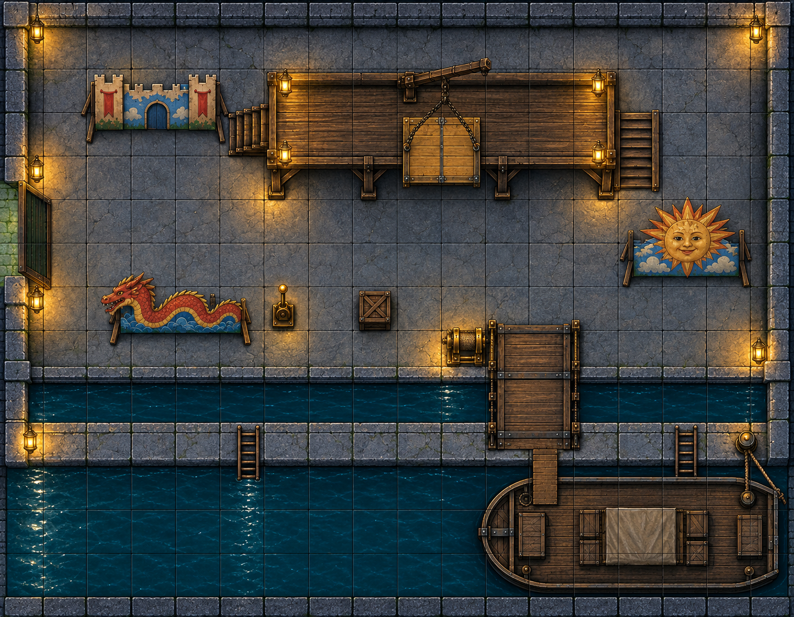

# Act 2, Session 3 — “The Last Receipt”

> **Prepared, not played.** Begin immediately after Demona catches Commissioner Bellafonte. Italicized blockquotes and labeled handouts are player-facing; all other text is for the Director. Do not record outcomes until play.

## At a glance

Bellafonte is caught; Fenwick escaped; the four heroes retain limited deputy work letters for the repair-fraud claim. Bellafonte's private book connects his false approvals to Civic Loomworks. Fenwick answers the book's emergency phrase with an encrypted meeting proposal. The heroes must read his message and send an encrypted answer before confronting him at the Third Ledger Lift Yard. The Cistern Steps residents see their pump working before this session ends.

| Time | Scene | Dramatic question |
| --- | --- | --- |
| 0:00–0:20 | 1. Bellafonte | Will he help face Fenwick, or only surrender what he knows? |
| 0:20–0:30 | 2. Hanae | How are the prisoner and evidence secured? |
| 0:30–1:15 | 3. Cipher and preparations | What does Fenwick want, what will the heroes tell him, and how will they close his exits? |
| 1:15–1:25 | 4. The meeting | How close can they draw Fenwick? |
| 1:25–2:00 | 5. Blue-Wax Retrieval | Can they keep the book, seize the satchel, and stop his escape? |
| 2:00–2:15 | 6. Receipts and water | What proof remains, and what changes at Cistern Steps? |
| 2:15–2:30 | Protected buffer | Absorb a scene that genuinely ran long. |

**135 planned minutes + 15-minute buffer = 2.5 hours.** Cut Bellafonte's exchange at minute 20, decoding at minute 50, preparations at minute 75. Start initiative by minute 85 and stop the paid crew after four rounds. Use one Standard-budget fight; do not inflate it to Hard.

### Director's situation

Bellafonte took gifts and certified repairs he knew were not done. The Cistern Steps replacement pump was paid for but never installed. His hidden book records Fenwick's gifts and Civic Loomworks invoice numbers. Fenwick fled the house without knowing Bellafonte was captured. The emergency phrase tells him the book survives, so he answers in a simple letter-substitution code and comes personally to retrieve it. His paid crew will cover his escape and take the book; they do not know about Vesk Aldermere's erasure.

Fenwick keeps his own dispatch satchel as insurance against Loomworks; he does not trust his employers to protect him if Bellafonte's book surfaces. It has matching dispatches, repeated **L.R.A.** references, and a scheduled Bureau of Accounts file transfer, but does not explain L.R.A. Neither man knows Merovanni, Dury, the Author, or the mechanism of the erasures. Bellafonte's gallery security was ordinary magic, not a clue about M.A.C.'s personhood.

Reginald Veros dismisses Melvin Corbin **off-screen** during the interval before the meeting. Melvin tells the heroes himself, then works with them as an independent investigator. Hanae keeps their existing work letters active for this claim. Respect Session 2's actual reward, Stamina, Recoveries, and Victories; award nothing twice.

### People

- **Ottaviano Bellafonte:** A frightened, vain repairs commissioner. He wants to keep his title, clean clothes, a private room, and protection from Fenwick. He has no power to demand any of these. Courtesy steadies him; pain gets an answer quickly but ruins him as a convincing lure.
- **Rudiger Fenwick:** Loomworks broker. He wants Bellafonte's book destroyed, his own satchel retained, and a clear route to the barge. He understands contractor records and billing codes, not the higher conspiracy. He is not a combat boss.
- **Lieutenant Hanae Petrovic:** Takes custody, receipts the evidence, keeps the work letters active, and reopens the pump order. She cannot issue universal warrants or fight inside the private yard.
- **Melvin Corbin:** Vesk's former investigator. He watches, follows, interviews, and checks records. He has no badge or arrest power, but he brings playable leads back to the heroes and shares decisions with them.
- **Irena Vale:** Paid retrieval captain. She wants the book, Fenwick out, and her crew home alive. She surrenders when the extraction is lost.

---

## Scene 1 — Bellafonte (0:00–0:20)

**Question:** Can the heroes keep Bellafonte calm enough to face Fenwick? His confession and the book are not gated by this.

Use the nearest private room in the house; preserve the heroes' actual position from Session 2.

> *Bellafonte holds his torn coat shut with one hand. A water glass sits on the table, just beyond his reach. He looks at the chair, then at Demona.*
>
> *“I can tell you who brought me the reports. Please let me sit down first.”*

He fears Fenwick, but fears immediate harm more. A chair, water, his title, or a credible assurance of protection makes him feel he retains a little control. He readily believes a plausible lie about comforts. He cannot set conditions for telling the truth.

If asked why he needs protection:

> *“Fenwick has bought officers and clerks before. If he learns I spoke, please do not let him near wherever Petrovic holds me.”*

### Negotiation: willing help, not facts

Use Draw Steel negotiation with **Interest 2, Patience 3, Impression 3**. One hero leads each argument; another can help. An argument needs an approach Bellafonte values and a reason he should believe it. Roll Reason, Intuition, or Presence with a fitting skill.

- **Motivations:** **Protection** from Fenwick; **Power** through the title Commissioner and the importance of his testimony; **Greed** through decent food, clothes, private custody, or preserving collection pieces unrelated to fraud. Each motivation can increase Interest only once. A successful Lie argument may promise more than the heroes can deliver.
- **Pitfall:** **Justice**. If an argument asks him to cooperate because the residents deserve fairness, Interest and Patience each fall by 1. Evidence of his guilt is still useful leverage.
- **Matching motivation:** 11 or less: Patience −1. 12–16: Interest +1, Patience −1. 17+: Interest +1. Give a strong, specific offer the 17+ result without a roll.
- **No matching motivation:** 11 or less: Interest −1, Patience −1. 12–16: Patience −1. 17+: Interest +1, Patience −1. A natural 19–20 avoids the Patience loss.

Stop after three arguments, at Interest 4, at Patience 0, or at minute 20. **Interest 3+ with no obvious injury:** he can appear at Fenwick's meeting. **Interest 2 or less:** he still tells all and supplies the emergency phrase, but refuses to face Fenwick. **Obvious injury or continued violence after he begins talking:** he tells all immediately, but Hanae will not use him as bait. Do not run a torture challenge or attach a later trial consequence.

Dorian's **Commanding Presence** raises present heroes' effective Renown by 2 here. If Bellafonte knows a hero and that Renown meets Impression 3, fame gives an edge to applicable Lead, Persuade, or Flirt arguments; infamy gives an edge to Brag, Interrogate, or Intimidate. Demona's **Silver Tongue** gives an edge only on a test to discover a motivation or pitfall. M.A.C.'s **Pardon My Friend** can replace a failed *Presence* test by an ally within 5 squares with M.A.C.'s Presence roll and a bane, not a Reason or Intuition test.

If the heroes threaten to make him visibly unable to play his part, Melvin names the tradeoff:

> *Melvin watches Bellafonte's hand shake over the pen. “If we need him at the meeting, Fenwick has to believe he came of his own accord. Leave him able to speak and write.”*

### His account

Deliver these facts through conversation as soon as the heroes press him or he sees a path to safety. Do not require three magic questions or successful rolls.

> *“Fenwick brought me a gilt mask and two cavalry miniatures. I signed three completion reports for Civic Loomworks and Festooning. The pump at Cistern Steps was not installed. I knew that when I signed.”*
>
> *“He brought the forms, collected my signature, and returned with another gift when he needed another approval. I kept a book with the dates and invoice numbers. If he was ever caught, I expected him to blame me for everything.”*

**Why?**

> *“At first I wanted the gifts. Then I was afraid Fenwick would tell someone about the first report if I stopped signing.”*

**Who gives Fenwick orders?**

> *“I dealt with Fenwick and his contractor. I never met anyone who sent money to Loomworks, and I cannot give you a name I do not know.”*

**What about the pump?**

> *“The report says it was installed. The work order and the contractor's bond still exist. Give Petrovic the report; she can reopen the order without waiting for Fenwick.”*

### The hidden book

> *“In the north alcove, the narrow plinth has a green stone top. Press the brass leaf underneath and pull. My book is in the false bottom.”*
>
> *“I wrote an emergency phrase on its cover. Send it to Loomworks's south dispatch box, and Fenwick will answer. He uses the same letter-substitution engram on his letters and gift labels. I kept two of the labels in the book.”*

If asked for the key:

> *“I never learned it. His runner read the letters aloud when he delivered them. I wrote down the gifts after I opened their boxes.”*

No search test. Give the heroes this handout:

> **O. Bellafonte — private receipts**
>
> | Date | Approval signed | Gift from R. Fenwick | Invoice |
> | --- | --- | --- | --- |
> | 7 Veld | Cistern Steps pump installed and tested | Gilt festival mask | C.L.F. 18-441 |
> | 11 Veld | Foxes fountain stone supplied | Two cavalry miniatures | C.L.F. 18-447 |
> | 14 Veld | Factory thread treatment delivered | Private sale invitation | C.L.F. 18-452 |
>
> **Inside cover:** “The collection is closed. I kept the last receipt.” Send to Civic Loomworks south dispatch box. Do not send the book.
>
> **Two labels tucked inside the cover:**
>
> C.L.F. 18-441 — TOSN DZFV
>
> C.L.F. 18-452 — RGOBZNH FZSH

“The last receipt” means this book. Fenwick cannot safely delegate its retrieval because the records incriminate him. The labels describe the gifts recorded against those invoice numbers; their wording is shorter than Bellafonte's entries. There is **no printed key**. Bellafonte can explain how the correspondence reached him, but **the heroes, not he or Melvin, must deduce the letter mappings, decipher Fenwick's reply and encrypt their answer in Scene 3**.

At minute 20, provide any undisclosed core facts, record whether Bellafonte can appear, and bring Hanae in.

## Scene 2 — Hanae takes custody (0:20–0:30)

**Question:** What does the party keep, and what will the city do now that it has the false report?

Hanae arrives with two Gold Buttons. She secures Bellafonte and receipts any original papers the heroes choose to give her; they may keep copies. If they retain the private book for the sting, she records that fact rather than confiscating it. Her officers watch the public street outside the lift yard later; they do not add combat turns.

> *Hanae sets Bellafonte's signed pump report beside the first entry in his private book. The dates match.*
>
> *“Your work letters remain valid for this repair-fraud inquiry. I will take Bellafonte into custody. You can keep the book for the meeting with Fenwick, but make me a copy before you go.”*
>
> *She taps the false completion report. “I can reopen the Cistern Steps work order today. We do not have to wait until Fenwick is caught to replace that pump.”*

If Bellafonte is calm and willing, Hanae will bring him under guard to the yard and hold an outer cordon. If he is injured, panicked, or refuses to appear:

> *“He has told us enough. I will keep him somewhere Fenwick cannot reach him. Use his message and send a courier to the meeting.”*

Bellafonte writes the emergency phrase in his own hand before she takes him away. If he cannot hold a pen, a hero copies his words and signs O.B.; Fenwick will recognize the unfamiliar hand and arrive suspicious, but he still comes for the book. If Session 2's promised **+1 Wealth per hero** was not paid, Hanae arranges it now; if it was paid, do not pay it again.

---

## Scene 3 — The blue-wax correspondence (0:30–1:15)

**Question:** Can the heroes use Fenwick's own code to arrange a meeting on useful terms? The destination is not gated by a test.

### The first note

A controlled courier places Bellafonte's warning—or the heroes' copy if he could not write—in Civic Loomworks's south dispatch box. The heroes can choose the courier or watch the delivery; there is no roll unless they are trying to do something extra under observation.

> **Bellafonte's warning**
>
> Rudiger,
>
> The collection is closed. I kept the last receipt.
>
> O. Bellafonte

After the warning is delivered, Veros summons and dismisses Melvin away from the heroes. Melvin returns in an ordinary coat and resumes watching the box. Fenwick answers several hours after the warning arrived. When the heroes' courier collects the reply, Melvin brings it to the table **without opening it**.

> *“Reginald Veros dismissed me when I returned from Bellafonte's house. I had already decided to finish watching that box.”*
>
> *“Fenwick came himself. He read Bellafonte's note inside the dispatch office. Ten minutes later his runner put this in the box, and I watched our courier take it out. The seal is unbroken.”*
>
> *Melvin opens his notebook to a page of times and descriptions. “My badge helped, but my sources did not disappear with it. You can still go through the front door. I will watch the back.”*

If asked whether he wants a new assignment:

> *“I want to work with you, not hand you a case and disappear. I will bring back what I learn, and we can decide what to do with it.”*

He does not solve the cipher, know the yard yet, or act as a combatant.

### Player handout — Fenwick's encrypted reply

Give this separately from the Director's solution. It is Fenwick's handwriting under a warm-blue wax seal:

> **O. Bellafonte —**
>
> NKOGM SHMTHG SOUN YZGM. NKOGM CHSS ZUNHG MZGV OI NWP MZYF. CGOIT NKH CPPV. LPDH ZSPIH.
>
> **R. Fenwick**

### Work out the engram

Hand over the letter beside the receipts and labels. Explain only the rules, not any letter mapping:

> **Working out Fenwick's engram**
>
> Each written letter always stands for the same ordinary letter. Different written letters stand for different ordinary letters. Spaces and punctuation have not changed. There is no alphabet shift or arithmetic rule.
>
> Use the receipts, the labels and the letter to work out the replacements. Record each pair you discover. You will need those pairs to write your answer.
>
> Written letter: ___  Ordinary letter: ___

Let the players compare word lengths, repeated letters and plausible words. Do not substitute a Reason roll for the deduction or require frequency-analysis knowledge. Confirm a proposed word only when its replacements fit every occurrence. A useful character ability can confirm one guess or identify which documents belong together; it does not decode the page.

**Director-only solution:** “THIRD LEDGER LIFT YARD. THIRD BELL AFTER DARK IN TWO DAYS. BRING THE BOOK. COME ALONE.” Fenwick chose the second night to assemble the crew and ready the barge. He assumes Bellafonte will hide rather than expose a book that incriminates them both. He expects Bellafonte or one courier and the original book. His demand to come alone does not bind the heroes.

**Director-only key — ordinary → written:**

```text
Ordinary: ABCDEFGHIJKLMNOPQRSTUVWXYZ
Written:  ZCLMHUTKOEVSDIPRQGFNXBWAYJ
```

This is a fixed, scrambled substitution, not a Caesar shift. The two labels read **GILT MASK** and **PRIVATE SALE**. Matching them to the invoice entries establishes twelve ordinary letters: A, E, G, I, K, L, M, P, R, S, T and V. The meeting letter supplies the other nine it uses through context and cross-checking. The five unused letters—J, Q, U, X and Z—need not be solved.

**One workable deduction route, not a required order:**

1. The mask invoice makes **TOSN DZFV** a likely **GILT MASK**. Those replacements hold throughout the letter. The invitation invoice and the seven/four-letter pattern make **RGOBZNH FZSH** a likely **PRIVATE SALE**. Its S, A and L mappings agree with the mask label.
2. **NKH** has become **T_E**. **CPPV** ends in K and has a repeated middle letter. Fenwick is answering a warning about a book; **THE BOOK** supplies H, B and O. Check the resulting pairs elsewhere.
3. **NKOGM** now reads **THIR_** both times it appears. **THIRD** supplies D; the same pair completes **_ARK** and **_AYS** as **DARK** and **DAYS**. **CHSS** becomes **BELL** without another guess.
4. The surviving gaps in **LIFT**, **AFTER**, **IN**, **TWO**, **YARD**, and **COME ALONE** yield F, N, W, Y and C. Every proposed pair must agree with the labels and repeated words.

**Hints, only when needed:** After about three minutes without progress, ask, *“Which invoice number appears on both a label and a receipt?”* If they identify the gifts but stall on the letter, ask, *“What object does Fenwick expect you to bring, and which four-letter word has its middle letter repeated?”* If they need more purchase, confirm **CPPV = BOOK**, then let them propagate those pairs. A further hint can confirm **NKOGM = THIRD**. These are local footholds, not an alphabet handout.

**Pacing:** By minute 50, offer the next word-level hint if needed. If the group wants to move on, confirm their partial reading and supply only the unresolved words; then have them add those letter pairs to their sheet. Record whether hints were used, but do not punish them or cancel the meeting. Keep the full key Director-only unless the players explicitly opt out of the puzzle.

### The heroes answer in the same engram

Ask the heroes what they want Fenwick to believe. Their reply must confirm possession of the book and that someone will meet him; they may also try to change how close he approaches, whether he brings a case, or which entrance he uses. **Have a player write the plaintext, then encode it** with the same mapping. Bellafonte and Melvin do not do this for them. Keep the message to one or two short sentences so the task is playable.

If they want a neutral model, offer only the plaintext:

> **THE BOOK IS SAFE. I WILL COME.**

The encoded version, for the Director to check **after** a player attempts it, is:

```text
NKH CPPV OF FZUH. O WOSS LPDH.
```

A more aggressive lure, if the players invent it, can ask Fenwick to bring his document case to the central crate; a threat or claim that Bellafonte is wounded makes him cautious. The heroes own the wording. To check a custom answer, replace its written letters using the Director-only key and read what Fenwick would read. If their proposed wording needs an unsolved letter, let them rephrase it using known letters or return to their clues; do not require reconstruction of the entire alphabet. All letters in the neutral reply occur in the labels or the deciphered letter.

Accept minor transcription mistakes that leave the meaning clear. Fenwick keeps his chosen yard and time, but he can be persuaded to approach a particular crate or entrance there. If the reply is badly coded, reveals that Bellafonte is captive, or follows a warning copied in an unfamiliar hand, the meeting still happens, but Fenwick begins near the barge with an enforcer. By minute 55, offer the short neutral reply in plaintext and help them look up the pairs they have already recovered; the players still perform the encryption. Do not solve it off-screen with Bellafonte or Melvin.

The courier deposits the encoded reply in the box. Fenwick will come: he cannot allow that book to circulate. He will also bring retrieval hands. Do not announce their number yet.

### A full respite

The meeting is two nights away, leaving more than 24 hours. The heroes can take a **24-hour uninterrupted respite** in a safe place, with one respite activity each. At its end they regain all Stamina and Recoveries, convert current Victories to XP, and reset those Victories. Resolve any resulting character options at the table. If they choose not to rest, use their actual depleted state when setting the fight budget.

While they recover, Melvin inspects the named yard from public ground. When they regroup he lays a rough plan on the table:

> *“The yard has one street gate on the west side and a barge tied to the south quay. A gantry overlooks the meeting crate. Eight workers moved festival scenery there today, but they never loaded a wagon.”*
>
> *He marks a roof above the street. “One of them checks the roofs and windows every quarter hour. I cannot tell who Fenwick will bring with him. I can tell you where they are preparing to leave.”*

That is baseline information: gate, barge, gantry, lookout, two four-person yardhand squads. Melvin cannot know the enforcer count until Fenwick arrives. His scouting is concrete work, not an advantage that replaces player choices.

### The heroes prepare

Ask one open question:

> **Fenwick expects a book and a person who sent the coded answer. How will you make him come far enough into the yard to catch him, and how will you keep him from leaving with the book?**

Allow **at most two consequential setup tests**; do not turn this into a list of deputy errands. Give up to two advantages for actual preparations. A test is **Medium** with an appropriate characteristic and skill: 11 or less fails and brings a visible complication; 12–16 succeeds with alertness or exposed position; 17+ succeeds cleanly; natural 19–20 improves the advantage. A helper with a different useful skill can grant an edge. An action whose success is certain needs no test.

| If they choose to… | Benefit | On failure or costly success |
| --- | --- | --- |
| Control the waiting barge | Fenwick needs an extra main action at the helm before departure | Disturbed rigging alerts the watcher; Fenwick starts 2 squares nearer the barge |
| Use Hanae's authority to close the street gate | Gate starts barred; paid crew cannot withdraw west without opening it with a main action at A6 | Visible officers make Fenwick alert; an enforcer stays at his side |
| Take the gantry or a roof | One or two heroes start at F3–N5 with cover and a line of sight | The lookout notices their route |
| Pose as Bellafonte's courier or a Loomworks worker | Fenwick approaches the central crate and displays his satchel | He remains near M10 with an enforcer if he spots the deception |
| Split the crew with a plausible order | One enforcer begins at the street gate, away from Fenwick | Vale keeps everyone together |
| Conceal the original and show a copy or wrapped object | The original begins with a hidden hero; the prop can be surrendered | Fenwick hangs back when the copy looks wrong |

Reward an equivalent clever plan with position, secured evidence, or another escape action Fenwick must spend. If the heroes devise a credible way to seize Fenwick and neutralize the crew before they can fight, play that outcome; do not conjure violence merely to preserve the prepared encounter. In the ordinary case the crew attacks to extract him and the book.

**Bellafonte present:** If he agreed and remains uninjured, place him at I8; Fenwick approaches K8 unless the encoded reply or a setup failure made him suspicious. **Courier instead:** Bellafonte stays in custody. A hero or controlled courier begins at I8; Fenwick starts M10 with an enforcer unless a successful lure brings him closer. If the first note had to be copied because Bellafonte could not write, Fenwick remains at M10 with that enforcer even when the encoded answer is correct. Bellafonte's condition is not a second puzzle gate.

At minute 75, record each hero's exact legal starting square and cut to the yard. Heroes without a special position begin within 2 squares of I8.

---

## Scene 4 — The meeting (1:15–1:25)

**Question:** Can the heroes draw Fenwick away from his exit and get him to expose the satchel?

> *Painted festival flats lean against the walls of the freight yard: a castle gate, a smiling sun, the coiled body of a canvas dragon. A two-square-high gantry crosses above the central loading crate. Beyond the lower quay, a narrow barge waits under the movable canal bridge.*
>
> *Fenwick comes through the street gate with a blue-wax satchel under his arm. Workers set down their hooks as he passes. He does not set the satchel down.*

If Bellafonte is present:

> *Fenwick stops short of the crate. “You said the book survived. Show me the entry you kept, then I will tell you how we get out of this.”*

If a courier meets him:

> *Fenwick stays by Vale. “Bellafonte has the book. Why did he send you to carry it?”*

A player can answer freely, show a real invoice number, display a convincing prop, or reveal their authority. A successful encoded lure or credible answer brings Fenwick to K8 with the satchel visible unless he already recognized the copied first note. In that case he remains at M10 near the barge but will open the satchel to check the number. Do not add a surprise “page twelve” test.

Fenwick speaks in complete, guarded sentences. Use only the answers the heroes draw out:

- **On the gifts:** *“I carried what Civic Loomworks purchased. Bellafonte signed the work reports. He can explain why he kept a private record.”*
- **Shown the ledger's invoice numbers:** *“Those numbers belong to Loomworks. Close the book before my people see it.”* This acknowledges the link without a villain speech.
- **Asked who employs him:** *“I am retained by Civic Loomworks and Festooning.”*
- **Asked who funds the company:** *“I receive dispatches and payment instructions. I do not meet the people who authorize the accounts.”*
- **Told he is under arrest:** *“Your work letters let you ask questions. They do not make this yard yours.”*

Melvin watches from a public warehouse window. If the party has not spotted the gantry watcher, his agreed signal makes the danger visible:

> *A pebble clicks against the yard wall. Above the painted castle flat, a worker rises with a weighted net.*

Vale acts when the heroes arrest Fenwick, when he recognizes a trap, or at minute 85 if talk continues:

> *“Take the book. Get Mr. Fenwick to the barge.”*

Roll normal initiative; the enemies get no free opening round. If the heroes earned a complete noncombat capture, skip initiative and resolve what they physically secured.

## Scene 5 — The Blue-Wax Retrieval (1:25–2:00)

### Objectives and ending

The heroes have three contestable objectives: keep Bellafonte's ledger, stop Fenwick leaving the yard, and secure his blue-wax satchel. They can win some without winning all. The crew is trying to extract, not massacre the party.

The fight ends on the first applicable trigger:

- **Vale reaches 0 Stamina while Fenwick is grabbed, unconscious or cut off from both exits:** Remaining paid crew surrender immediately.
- **Fenwick is secured and the barge and street gate are unusable:** Vale offers surrender at the start of her next turn; accepting ends the fight.
- **End of round 4:** Crew who have reached an open exit withdraw. Trapped crew surrender. Fenwick escapes only if he has physically crossed an open map edge or departed aboard the prepared barge; otherwise he is caught in the collapse of the operation. Do not run round 5.
- **Heroes retreat:** The crew takes only evidence it physically possesses. Bellafonte's ledger still exists if the heroes carried or hid the original.

### Budget — use actual post-respite state

For each hero, encounter strength is **4 + 2 × level**. Sum the four heroes, then add one average hero's strength for every 2 average current Victories. Pre-respite Victories have already converted to XP and do not count. Target the top of **Standard**: party ES plus approximately one average hero.

All three hostile profiles are custom scenario creatures with provisional EVs. Arithmetic validation is not a combat playtest.

| Effective party state | Captain | Enforcers | Yardhands | EV | Creatures |
| --- | --- | --- | --- | --- | --- |
| Four level-3 heroes, 0–1 average Victories | 1 | 2 | 8 | 50 | 11 |
| Four level-4 heroes, or effective ES about 50 | 1 | 3 | 8 | 60 | 12 |
| Effective ES about 60 | 1 | 4 | 8 | 70 | 13 |
| Effective ES about 70 | 1 | 5 | 8 | 80 | 14 |

EV costs: **Vale 20; each enforcer 10; four yardhands 5**. Eight yardhands always form two squads of four. No creature exceeds level 4. At the two larger budgets, at least half the opponents are minions. There are no hidden reinforcements.

**Depleted-party adjustment:** If the heroes decline the respite and two or more begin below half Stamina or with no Recoveries, remove one enforcer before the exchange. Do not replace it with another creature. Keep the fight worth 1 Victory if completed.

### Initiative groups

Use three enemy groups and alternate them with hero turns:

- **Blue:** Vale, Fenwick and four yardhands.
- **Gray:** Half the enforcers, rounded up.
- **White:** Remaining enforcers and four yardhands.

Bellafonte, if present, acts at the end of Blue. He takes cover and follows a directly adjacent hero's simple instruction. He does not attack.

Before anyone declares a full turn, determine which side goes first. Neither side gets a surprise round: Melvin can expose the net carrier, and Fenwick brought a crew expecting trouble even if he personally believed the lure. Roll 1d10. On 6+, the players choose which side goes first; on 1–5, the Director chooses. Thereafter the sides alternate, with the players choosing one unactivated hero on each hero turn and the Director choosing one unactivated enemy group on each enemy turn. When an enemy group activates, every creature assigned to it takes a turn. The side that went first in round 1 goes first in later rounds.

### Tactical layout — one square = 5 feet



*North is up. The map contains no creatures or starting-position markers; place them from the instructions below after applying the heroes' preparations.*

Draw an **18 × 14-square yard**, columns A–R west to east and rows 1–14 north to south.

| Feature | Position | Use |
| --- | --- | --- |
| Yard floor | B2–Q9 | Open flagstones; scattered scenery provides the listed cover only |
| Street gate | A5–A7 | West exit; starts open unless secured during preparation; Hanae's distant cordon waits beyond it |
| Loading gantry | F3–N5 | Height 2; stairs at E4–F4 and O4–O5 |
| Meeting crate | I8 | Ledger or decoy begins here unless held by a hero |
| Winch | K9 | Controls the hinged loading bridge; maneuver, no test |
| Loading bridge | L9–N11 | Starts lowered; direct route over the service cut to the quay |
| Crane control | F8 | Moves the hanging platform between gantry and quay |
| Hanging platform | J4–K5 or J9–K10 | Height follows its destination; can carry four size-1 creatures |
| Festival flats | C3–E3, C8–E8, O6–Q6 | Height 1, cover; each can be tipped once |
| Quay | B11–R11 | One square above canal water; ladders at F11 and Q11 |
| Barge | M12–R14 | Fenwick's escape; gangplank at M11–M12, mooring at R11 |
| Canal | A12–L14 | Water 1 square below quay; difficult terrain while swimming |

**Starting positions:**

- Unplaced heroes begin within 2 squares of I8. Apply earned gantry, barge or gate positions instead of returning them here.
- **Bellafonte present:** I8. Fenwick K8 by default, or M10 if a coded warning or failed setup made him suspicious. Vale N8.
- **Courier present:** Bellafonte is absent. The courier or meeting hero begins I8. Fenwick starts M10, or K8 if a successful lure brought him closer and Bellafonte's first note was not copied. Vale L9.
- First yardhand squad: C5–F5. Second squad: O8–R8 unless a setup consequence moved it to the gantry.
- Spread enforcers between L7, N7, P9, D7 and G10 in that order. An enforcer separated by preparation begins at A6.

Whenever Fenwick starts at M10, move one of the listed enforcers adjacent to him. Do not add an extra creature.

### Interactive terrain — three complete systems

#### 1. Loading bridge and winch

The hinged loading bridge at L9–N11 starts **lowered**, creating the shortest path from the meeting crate to the quay. A creature adjacent to the winch at K9 spends a **maneuver, no test**, to raise or lower it.

- **Lowered:** L9–N11 are ordinary floor squares.
- **Raised:** Those squares become an impassable height-2 barrier. The quay remains reachable by going around the west end, adding at least 6 squares to the route.
- A creature on the bridge when it rises chooses the yard side or quay side and is slid to the nearest unoccupied square there. This causes no damage.
- The bridge cannot be held halfway. Winch Stamina 20; destroying it leaves the bridge in its current position.

State its position aloud after every use.

#### 2. Cargo crane

The 2 × 2 platform begins at J4–K5 beside the gantry. A creature adjacent to the control at F8 spends a **maneuver, no test**, to move it to J9–K10 beside the quay, or back to the gantry. Everyone on it moves with it. The platform settles at the destination at the end of that creature's turn.

The support rope has Stamina 15. A creature adjacent to the control or rope can cut it with a main action, no roll. If cut, the platform falls into J9–K10: creatures there or on it take 4 damage and fall prone; those squares become difficult terrain. Then the crane is spent.

#### 3. Festival flats

Each marked flat is height 1 and grants cover. A creature adjacent to one spends a **main action, no test**, to tip it into a chosen 3 × 1 line extending from the flat.

Creatures in the line take 4 damage and are pushed 1 away; stability applies. The fallen flat becomes height-1 cover and difficult terrain. Each flat can be tipped once. These features carry no enemy EV.

### The barge escape — visible and contestable

Preparing the barge requires two visible main actions before Fenwick can board it.

Fenwick carries the key for the mooring lock. Before the barge can depart:

1. **Unlock and release the mooring at R11:** Fenwick spends a main action adjacent to it.
2. **Lower and secure the gangplank at M11:** Fenwick spends a later main action adjacent to it.
3. Fenwick must then move onto the barge. It clears the yard at the **end of his next Blue activation**, never before the end of round 3.

The steps must occur in order. Other crew can defend or move Fenwick but cannot use his key. A hero can undo a completed step with a main action, jam the mooring with a substantial held object as a maneuver, take the key from a grabbed or unconscious Fenwick, or destroy the mooring mechanism (Stamina 20). If the barge was controlled during setup, Fenwick must also spend one main action at the helm before it can depart.

Do not override successful blocking, forced movement or a grab. If Fenwick has not actually departed by the end of round 4, he does not escape by narration.

Fenwick cannot escape through the street gate: Hanae's officers are watching beyond it and take him into custody if he crosses the west edge. Paid crew can still use that edge to withdraw when the four-round clock ends; the officers prioritize the named fugitive rather than creating a second off-map combat. Fenwick therefore directs his escape toward the barge from the start.

### Evidence objects

**Bellafonte's ledger:** Size 1T, Stamina 10. Picking it up or taking it from an unattended crate is a maneuver. Taking it from an unwilling creature requires that creature to be grabbed, unconscious or willing. A concealed original remains concealed until its carrier reveals or loses it.

**Fenwick's satchel:** Carried by Fenwick. The same handling rules apply. If Fenwick is grabbed, a different adjacent creature can use a maneuver to take it. If he becomes unconscious, he drops it in his space.

The crew targets the ledger, not an unannounced duplicate. They cannot know which copy is real without examining it.

### Fenwick and Bellafonte — noncombatants

| NPC | Size | Speed | Stamina | Stability | M | A | R | I | P |
| --- | --- | --- | --- | --- | --- | --- | --- | --- | --- | --- |
| Fenwick | 1M | 5 | 20 | 0 | +0 | +1 | +2 | +1 | +2 |
| Bellafonte | 1M | 5 | 20 | 0 | +0 | +0 | +2 | +1 | +2 |

Neither has attacks, free strikes, immunities, triggered actions or villain actions. Fenwick uses his move, maneuver and main action only to handle evidence, complete the barge procedure, escape a grab or flee. Bellafonte takes cover and obeys a nearby hero's immediate direction; he does not attempt a clever independent escape during the cleanup attack.

Reducing either to 0 can knock them unconscious instead of killing them. A captive cannot pass through creatures, barriers or grabs by fiat.

### Core combat rules used here

- Heroes and enemy groups alternate. Every creature acts once per round. A non-minion normally has a move, maneuver and main action; a main action can buy another move or maneuver.
- **Power rolls:** 2d10 + listed modifier. Results of ≤11 / 12–16 / 17+ are tiers 1/2/3. A natural 19–20 produces tier 3 and grants an additional main action. An edge adds 2 and a bane subtracts 2; two edges or banes instead raise or lower the outcome by one tier.
- **Malice:** Start with average current Victories, rounded down. At each round's start add living heroes plus the round number. Spend Malice only on abilities printed below.
- **Cover:** A damaging ability takes a bane when a solid intervening object blocks at least half the target.
- **Difficult terrain:** Each square costs 1 additional square of movement.
- **Falling:** A fall of 2 squares from the gantry deals 4 damage and leaves the creature prone. Reduce effective height by Agility. Falling 1 square into the canal deals no damage.
- **Canal:** Swimming squares are difficult terrain. Climbing a quay ladder costs 2 squares of movement per vertical square; climbing the bare quay costs 3.
- **Prone:** Bane on strikes; melee strikes against the creature gain an edge. Standing is a maneuver.
- **Slowed:** Speed 2 and cannot shift.
- **Grabbed:** Speed 0; cannot be force moved except by the grabber. The grabber moves at half speed while dragging a creature of its size or larger.
- **Grab:** Maneuver, melee 1, one creature. Roll Might: ≤11 no effect; 12–16 grabbed after the target may make a melee free strike; 17+ grabbed. Fenwick and Bellafonte have no free strike, so tier 2 grabs them without damage. Normally target your size or smaller; Might 2+ permits a target up to a size equal to Might.
- **Escape Grab:** Maneuver; roll Might or Agility, with a bane if smaller than the grabber: ≤11 no effect; 12–16 escape after the grabber may make a melee free strike; 17+ escape cleanly.
- **Opportunity attacks:** An adjacent enemy willingly moving away without shifting or teleporting provokes a melee free strike. Forced movement does not.
- **Aid Attack:** Maneuver; choose an adjacent enemy. The next ability roll an ally makes against that enemy before the start of the aiding creature's next turn gains an edge. A Grab is a test rather than an ability roll, so Aid Attack cannot improve a Grab.

### Minion rules used here

Each four-person yardhand squad has **36 Stamina** (four × 9) and a separate pool. A squad makes one shared attack roll; each target takes one result, plus Free Strike damage for each additional attacker on that target, to a maximum of three attackers total.

Damage reduces the squad pool; remove one minion for every 9 Stamina lost. Non-area overflow removes additional nearest squadmates. Area damage is applied once per minion in the area, capped at 9 per affected member before immunity or weakness. No casualties occur outside the area. Minions cannot regain Stamina or gain temporary Stamina.

A minion takes a move and main action, a move and maneuver, or two moves—not all three. On a natural 19–20, each participating minion gains another main action, resolved together under the same squad rules.

### Three complete hostile profiles — homebrew

These creatures are humanoid paid contractors. They have no damage immunities, weaknesses or special movement unless stated. Their blue-wax badges are company credentials, not magic items.

#### Blue-Wax Captain Irena Vale — level 4 Elite Controller, EV 20

| Size | Speed | Stamina | Stability | Free Strike | M | A | R | I | P |
| --- | --- | --- | --- | --- | --- | --- | --- | --- | --- | --- |
| 1M | 5 | 100 | 1 | 5 | +1 | +2 | +2 | +2 | +2 |

Humanoid. Winded at 50.

**Weighted Baton — signature, main action.** Melee, Strike, Weapon; melee 1, one creature or object. Roll +2:

- ≤11: 6 damage; slide 1.
- 12–16: 10 damage; slide 2.
- 17+: 14 damage; slide 3; A < 2 slowed (EoT).

**Extraction Order — maneuver, once per round.** One willing ally or Fenwick within 10 shifts up to 3. This grants movement only, not an attack or object interaction.

**Change Places — triggered action, once per round.** An adjacent ally is targeted by a strike. Vale and that ally shift to exchange spaces; Vale becomes the target. Both spaces must be legal for both creatures.

**2 Malice — Smoke the Route, maneuver.** Place a 3-cube smoke cloud within 8. It lasts until the start of Vale's next turn. Squares in it are difficult terrain; strikes crossing more than 1 square of smoke take a bane. Vale cannot have more than one such cloud at once.

**4 Malice — Move the Crew, main action.** Up to three willing allies within 10 move up to their speed. This is ordinary movement and can provoke opportunity attacks. One of them can make a free strike after moving if a legal target is available.

**Paid Extraction — trait.** At the start of Vale's turn, if Fenwick is unconscious or grabbed and both the street gate and barge route are unusable, she offers surrender. If accepted, the crew drops weapons and the fight ends.

**Tactics:** Move Fenwick and enforcers toward the quay, slide heroes off the direct route and use smoke to cover withdrawal. She does not attack a dying hero or fight to the death.

#### Cleanup Enforcer — level 3 Platoon Defender, EV 10

| Size | Speed | Stamina | Stability | Free Strike | M | A | R | I | P |
| --- | --- | --- | --- | --- | --- | --- | --- | --- | --- | --- |
| 1M | 5 | 65 | 2 | 5 | +2 | +1 | +0 | +1 | +0 |

Humanoid. Winded at 32.

**Boarding Hook — signature, main action.** Melee, Strike, Weapon; melee 2, one creature or object. Roll +2:

- ≤11: 6 damage; pull 1.
- 12–16: 10 damage; M < 2 pull 2.
- 17+: 14 damage; M < 3 pull 3; target grabbed if it finishes adjacent to the enforcer.

**Bodyguard — triggered action, once per round.** Fenwick or an adjacent ally is hit by a strike. The enforcer shifts up to 2 to an unoccupied space adjacent to that creature, reduces the damage by 4, and takes 4 unpreventable damage. No legal destination means no trigger.

**3 Malice — Weighted Net, main action.** Ranged, Weapon; ranged 5, one creature. Roll +1:

- ≤11: 4 damage.
- 12–16: 6 damage; A < 2 slowed (EoT).
- 17+: 8 damage; A < 3 slowed and prone.

**Hold the Route — trait.** The enforcer's melee free strike deals 2 extra damage to a creature carrying the ledger or satchel. This does not apply to other strikes.

**Tactics:** Stand between heroes and Fenwick, pull evidence carriers away from exits and use Bodyguard rather than appearing from nowhere. Surrender when Vale does.

#### Loomworks Yardhand — level 2 Minion Harrier, EV 5 per four

| Size | Speed | Stamina each | Stability | Free Strike | M | A | R | I | P |
| --- | --- | --- | --- | --- | --- | --- | --- | --- | --- | --- |
| 1M | 6 | 9 | 0 | 3 | +1 | +1 | −1 | +0 | +0 |

Humanoid. No captain bonus or hidden reinforcements.

**Hook, Net and Haul — signature, main action.** Melee, Strike, Weapon; melee 2, one creature or object per participating minion. Shared squad roll +1:

- ≤11: 3 damage.
- 12–16: 4 damage; pull 1.
- 17+: 5 damage; pull 2.

Each additional participating minion on the same target adds 3 damage, to a maximum of three attackers total.

**Smoke Pot — maneuver, once per squad per encounter.** One participating minion places a 2-cube smoke cloud within 5. It lasts until the end of that squad's next turn. Squares in it are difficult terrain; strikes crossing more than 1 square of smoke take a bane.

**Quick Hands — trait.** A yardhand adjacent to an unattended ledger or satchel can pick it up as its maneuver. This does not take an object from a conscious creature.

**Tactics:** Stay in two visible clusters so area abilities remain valuable. One squad contests the street gate; the other supports the barge. They withdraw or surrender with Vale.

### Player-facing feedback during the fight

On the first attempt to prepare the barge:

> *Fenwick fits a small key into the brass lock. The mooring chain rattles loose and strikes the quay. Across the deck, the gangplank remains upright in its frame.*

Tell the players that the mooring step is complete and the gangplank remains the next required action.

When the second step is completed:

> *The gangplank drops across the water with a wooden crack. The barge rocks against the quay, its bow still inside the berth.*

Tell the players that Fenwick must reach the barge and remain aboard through his next Blue activation before it departs.

When Vale's crew is ready to surrender:

> *Vale looks from Fenwick to the blocked exits, then lowers her baton.*
>
> *“The contract is over. Let my people walk and the book stays where it is.”*

The heroes can demand that the crew submit to Hanae instead. Vale agrees if clearly defeated; do not restart combat over wording.

---

## Scene 6 — Receipts and water (2:00–2:15)

Spend about five minutes on what the heroes physically secured, four on Melvin's next line of inquiry, and six at Cistern Steps. If the fight was bypassed, use the extra time for the residents instead of inventing a second threat.

### What is in hand?

Use only evidence the heroes actually kept. Bellafonte's book is the persistent contractor lead; the encoded reply is a second document linking Fenwick to the meeting.

| Outcome | What they can act on next |
| --- | --- |
| Fenwick and satchel secured | His presence, the book, and matching dispatch numbers tie him directly to Loomworks. |
| Fenwick escaped; satchel secured | The dispatches corroborate the book and point to L.R.A. and a Bureau file transfer. |
| Fenwick secured; satchel lost | His admission or capture, Bellafonte's book, and the coded meeting note support an inquiry at Loomworks's south office. |
| Both lost | Bellafonte's book still names Civic Loomworks and Festooning, and its cover gives the south dispatch-box entrance. The contractor office is a location, not another riddle. |

If the satchel is secured, give this player handout:

> **Civic Loomworks and Festooning — dispatch abstracts**
>
> | Dispatch | Charge | Routing |
> | --- | --- | --- |
> | CLF 18-441 | Dog-leg pump removal and reassignment | L.R.A. / 44-C |
> | CLF 18-447 | Foxes fountain stone and fitting | L.R.A. / 44-C |
> | CLF 18-452 | Factory oil and treated thread | L.R.A. / 44-C |
>
> **Scheduled transfer:** One sealed Bureau of Accounts file. North records annex. Second bell after opening. Receiving name supplied separately.

The page shows the same account paid all three expenses. It does **not** spell out L.R.A. or identify an upstream official. If the satchel is lost, delay the account clue; do not invent it in Bellafonte's book.

Award **1 Victory** if the heroes overcome or outmaneuver the retrieval crew and retain the original book. Award **1 additional Victory** if they secure Fenwick or his satchel. Maximum **2**. A complete noncombat capture can earn the same rewards. Award after the operation; the pre-meeting respite already converted prior Victories and is not repeated.

### Melvin's first independent case

Melvin lays his observations next to the recovered documents, not a solved conspiracy. Ask which single lead the heroes want him to check first: **the L.R.A. account or Bureau file transfer** if they have the satchel, **a Loomworks officer or invoice address** in any outcome, or **Fenwick's likely refuge** if he escaped. He names a real method and a time to report back. He does not enter a dangerous site alone.

If they have the satchel:

> *“I can ask the records clerks which desk handles these account marks. I know one who will speak to me away from the Bureau. Do you want me to start with L.R.A. or with the file transfer?”*

If not:

> *“I can find out who signs the south-office dispatches. A courier knows where he takes a paper even when he never reads it. Shall I start there, or would you rather I look for Fenwick?”*

Let the players choose a discreet meeting place or message drop. Melvin then writes it in his personal notebook:

> *“I will check the lead you chose and meet you at our drop in two days. If I find a witness, we will hear their account together.”*

### Coda — Cistern Steps

Hanae uses Bellafonte's signed false-completion report to reopen the pump order. Civic Loomworks's posted performance bond pays an independent crew; Terenio's unpaid delivery slip is settled. This happens whether Fenwick was captured or escaped. Cut ahead two days. If the heroes want to help test the installation, let them describe it without a roll.

> *Three new bolts shine where the old pump's base had sat empty. Terenio braces a hand against the pipe while Maribel works the handle. It coughs brown water into a bucket. She pours that out, pumps again, and clear water follows.*
>
> *The waiting residents bring their buckets forward one by one. Maribel fills the first herself and passes it to an older man near the steps.*

Terenio, if asked about his work:

> *“Hanae settled the delivery I made to the Foxes fountain. This crew paid me for today's work before I lifted a stone.”*

Maribel, to the heroes:

> *“It runs. Would one of you give the handle a try? I want to know it works for everyone, not just for me.”*

Let each hero who wants to help do something small and concrete: work the handle, carry a bucket, check the bolts, or simply talk to a resident. Maribel and Terenio can answer questions. End when the last resident in the short queue has water. There is no extra Victory or Wealth for this coda; the result is the repair itself.

## Melvin after this session — Director guidance

Melvin is now a recurring independent investigator and active collaborator.

He can:

- Follow people and identify routines.
- Check ordinary addresses, businesses, deaths and public records.
- Interview low-level witnesses who distrust official institutions.
- Connect evidence and challenge a weak theory.
- Maintain discreet relationships with honest officers, clerks and former sources.

He cannot:

- Authorize searches, arrests or official access.
- Enter dangerous locations alone and resolve them off-screen.
- Produce secret answers that no source could know.
- Choose the heroes' objective or become a patron issuing assignments.

Bring his discoveries back as a person with observations, documents or a witness ready to speak. The heroes interpret them and take the decisive risks.

## After play — record, do not assume

- Bellafonte Available / Unavailable as bait; final Interest, promises, methods and facts shared:
- Insurance ledger recovered, copied, surrendered or lost:
- Session 2 reward paid now / already paid / still pending:
- Melvin's dismissal learned and partnership accepted or changed:
- Fenwick's message deciphered; exact encrypted reply sent and any errors or lure:
- Respite completed; actual level, XP conversion and resources:
- Two preparations attempted and their outcomes:
- Bellafonte present or courier used; Fenwick admissions obtained:
- Cleanup crew defeated / surrendered / withdrew; Vale's status:
- Fenwick captured / escaped / unconscious / dead:
- Blue-wax satchel secured / lost / destroyed:
- Victories awarded 0 / 1 / 2:
- First Melvin lead chosen: L.R.A. / Bureau transfer / Loomworks officer / Fenwick refuge / other:
- Evidence or prisoners delivered to Hanae; copies retained:
- Cistern Steps pump restored; promises kept and resident conversations:

Update campaign continuity only after recording these actual results. This document does not record Session 3 as played.

## Design references — not for table use

This rewrite borrows **methods, not text or plot**, from two human-authored public adventures:

- Kelsey Dionne's [The Secrets of Skyhorn Lighthouse (official sample)](https://d1vzi28wh99zvq.cloudfront.net/pdf_previews/215629-sample.pdf): each short scene has a concrete question and a transition once it is answered. The [RPGnet review](https://www.rpg.net/reviews/archive/18/18175.phtml) and [Ten Foot Pole review](https://tenfootpole.org/ironspike/?p=6977) praise its run-at-the-table scene organization.
- Leigh Carr with Lynne Hardy's [The Lightless Beacon (official free scenario)](https://www.chaosium.com/blogweareallus-download-the-lightless-beacon-for-call-of-cthulhu-in-remembrance-of-greg-stafford/) and its [public handouts](https://www.chaosium.com/content/FreePDFs/WeAreAllUs/2019/Lightless%20Beacon%20plain%20text%20handouts.pdf): documents convey actionable information in a character's own voice. An [independent review](https://golvin.substack.com/p/the-lightless-beacon-module-review) recommends its brisk, clue-led play.
